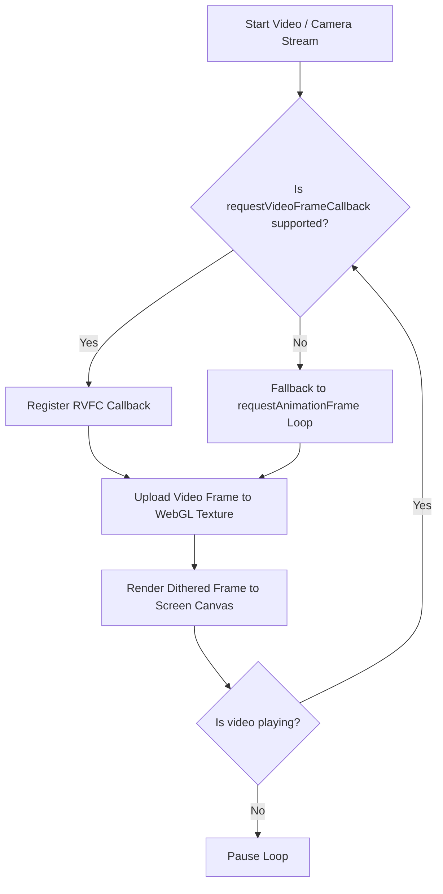

# Developer's Guide: High-Performance WebGL 2.0 Dithering

This guide explains the technical details of the **react-bitmap** engine, outlining the mathematical algorithms for dithering, GPU optimizations, and strategies to maintain 60 FPS in production WebGL applications.

---

## 1. The Math Behind the Shaders

Dithering mimics color depth by distributing quantization errors. **react-bitmap** implements ordered dithering using mathematical Bayer matrices and high-frequency wave patterns directly on the GPU.

### Ordered Dithering (Bayer Matrices)
Ordered dithering compares the brightness of a downsampled pixel with a threshold from a recurring matrix grid.
- **Bayer 2x2 Matrix**: A simple 4-step grid.
  $$\mathbf{M_2} = \frac{1}{4} \begin{bmatrix} 0 & 2 \\ 3 & 1 \end{bmatrix}$$
- **Bayer 4x4 Matrix**: A 16-step grid, balancing grain and structure.
  $$\mathbf{M_4} = \frac{1}{16} \begin{bmatrix} 0 & 8 & 2 & 10 \\ 12 & 4 & 14 & 6 \\ 3 & 11 & 1 & 9 \\ 15 & 7 & 13 & 5 \end{bmatrix}$$
- **Bayer 8x8 Matrix**: A 64-step grid, offering high-fidelity vintage rendering.

In the shader, the dither threshold value $D(x,y)$ (ranging from $-0.5$ to $0.5$) is added to the adjusted RGB values before mapping them to the closest palette color. This creates structured patterns in areas of gradient transition.

### Halftone Screen
Halftone dithering simulates print screening by generating a grid of circular dots. In the GLSL fragment shader, this is achieved by computing a high-frequency grid using rotating vectors and sine waves:
$$\text{pattern}(x, y) = \sin(x' \cdot \text{freq}) \cdot \sin(y' \cdot \text{freq})$$
where $(x', y')$ are rotated pixel coordinates ($45^\circ$ is standard to prevent screen-door Moire effects).

---

## 2. WebGL 2.0 Optimization Techniques

Standard CPU-based dithering (like Canvas2D `getImageData` loop) is extremely slow because it requires reading pixel data back from the GPU to the CPU, running Javascript loops on millions of pixels, and sending it back. This can clog the main thread and drop frame rates to 5-10 FPS for HD videos.

**react-bitmap** solves this with the following optimizations:

### 1. Integer Arrays and Lookups
Using **WebGL 2.0 (GLSL ES 3.00)**, we define Bayer matrices as uniform lookups or localized function arrays:
```glsl
float bayer8[64] = float[](
   0.0, 48.0, 12.0, 60.0, ...
);
```
This is compiled directly into GPU instructions, performing matrix index lookup in $O(1)$ time complexity.

### 2. Euclidean Color Distance Matching
To map a dithered RGB color to the closest color in a custom palette, the shader computes the 3D distance between vectors in the RGB color space:
$$\text{dist} = \sqrt{(r_1 - r_2)^2 + (g_1 - g_2)^2 + (b_1 - b_2)^2}$$
Using the GLSL native `distance(vec3, vec3)` function enables hardware-level vector optimization. The shader iterates up to 32 colors in a single pass to select the pixel color.

### 3. Dynamic Memory Allocation Prevention
Re-initializing canvas widths and heights on each frame triggers GPU buffer re-allocation, leading to frame drops. **react-bitmap** monitors dimensions and only updates the canvas viewport when the source resolution changes.

---

## 3. Video Playback & Webcam Synchronization

To render videos smoothly without audio-visual desync or visual stuttering, we implement two primary loops:



### 1. `requestVideoFrameCallback` (RVFC)
If available, `BitVideo` registers an RVFC callback on the HTML5 `<video>` element. This instructs the browser to notify the Javascript thread **only when a new video frame is ready to be painted**, matching the GPU render loop exactly to the video stream frequency.

### 2. Rendering While Paused
Adjusting settings (such as pixel size or palette) while a video is paused should update the viewport instantly. Both components hook React state changes to a static `renderSingleFrame()` execution, rendering immediately even when the video timeline is stationary.

---

## 4. Preventing GPU Resource & Context Leaks

In modern SPA applications (like React), components are mounted and unmounted frequently. If WebGL contexts are not disposed of properly, the browser can exceed the maximum hardware WebGL context limit (typically 8 to 16 concurrent contexts), throwing warnings and crashing canvas elements.

`react-bitmap` addresses this by implementing a complete cleanup sequence:
1. Deleting vertex arrays (`gl.deleteVertexArray`).
2. Deleting positions and texture coordinate buffers (`gl.deleteBuffer`).
3. Releasing loaded source textures (`gl.deleteTexture`).
4. Deleting compiled shader programs (`gl.deleteProgram`).
5. **Forcing Context Release**: Invoking `WEBGL_lose_context` extension programmatically:
```typescript
const ext = gl.getExtension('WEBGL_lose_context');
if (ext) {
  ext.loseContext(); // Reclaims all hardware memory instantly
}
```

---

## 5. Designing Custom Palettes

To build a custom palette, supply an array of hex colors (minimum 1, maximum 32 colors) to the `palette` prop.

### Tips for Custom Palettes:
- **Keep it small**: Shaders resolve colors faster with smaller arrays (e.g. 4-8 colors).
- **Maximize contrast**: Dithering looks best when colors cover the full range of light and dark values. Include both dark colors (shadows) and bright colors (highlights).
- **Match saturation**: Adjust the `saturation` and `contrast` props on the component to fit your palette's style (e.g., set saturation to `0` for monochrome palettes to prevent color-fringing, or set it to `1.5` for neon palettes).
